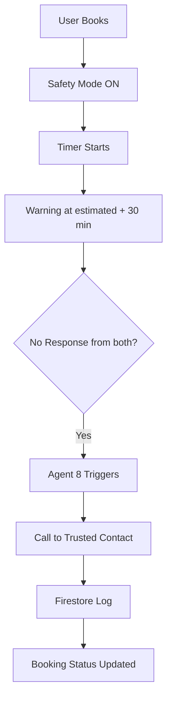

# KaamYaar AI — Multilingual Service Orchestration Engine

KaamYaar AI is a premium, resilient multi-agent system designed to automate the complete home-services transaction lifecycle in Pakistan. The platform processes raw, multilingual conversational requests (Urdu, Roman Urdu code-switching, Punjabi, Pashto, etc.), dynamically matches the best local service providers, handles secure booking transactions with Firestore, monitors service quality, and resolves disputes automatically.

---

## 🏗️ Cooperative Multi-Agent Pipeline

The architecture is designed as a sequential transaction pipeline. Each of the **8 agents** is specialized, self-contained, and uses standardized input/output Pydantic schemas to chain together:

```text
[User Input] 
     │
     ▼
┌──────────────┐      ┌──────────────┐      ┌──────────────┐      ┌──────────────┐
│  Language    │ ───> │   Provider   │ ───> │   Matching   │ ───> │   Pricing    │
│  Parser (A1) │      │Discovery (A2)│      │ Ranker (A3)  │      │ Engine (A4)  │
└──────────────┘      └──────────────┘      └──────────────┘      └──────────────┘
                                                                         │
                                                                         ▼
┌──────────────┐      ┌──────────────┐      ┌──────────────┐      ┌──────────────┐
│   Calling    │ <─── │   Dispute    │ <─── │   Quality    │ <─── │   Booking    │
│  Agent (A8)  │      │Resolver (A7) │      │ Monitor (A6) │      │Executor (A5) │
└──────────────┘      └──────────────┘      └──────────────┘      └──────────────┘
```

---

## 🤖 Agent Catalog & Specifications

| # | Agent | Responsibility / Business Goal | Technology & Models |
|---|---|---|---|
| **1** | **Language Parser** | Identifies regional scripts, normalizes SMS/Roman Urdu abbreviations, extracts slot details (type, location, budget, preferences). | `Gemini 2.0 Flash` + `Flash-Lite` Fallback |
| **2** | **Provider Discovery** | Filters candidates from a localized database using service types, availability states, and expanded distance radii (5km to 20km). | Logic-based Proximity Filter |
| **3** | **Matching Ranker** | Ranks providers using a 10-factor weighted formula (ratings, cancels, distance, skills). Explains recommendation reasoning in Urdu/English. Supports **Women Safety Mode** (CNIC-verified filters & safety factor weights). | `Gemini 2.0 Flash` + Weighted Scoring |
| **4** | **Pricing Engine** | Calculates dynamic pricing based on base rates, geographic distance, urgency premiums, and skill tiers with detailed explanations. | `Gemini 2.0 Flash` + Rules Matrix |
| **5** | **Booking Executor** | Processes booking transactions, updates provider availability, triggers double writes to Firestore, drafts warm localized SMS/receipts. Activates safety protocols for female users booking male providers. | `Gemini 2.0 Flash` + Firestore SDK |
| **6** | **Quality Monitor** | Simulates service lifecycles, collects client ratings, detects risk in reviews, and recalculates real-time provider statistics. | `Gemini 2.0 Flash` + Stats Analytics |
| **7** | **Dispute Resolver** | Classifies complaint severity, executes refund calculations (partial/full + convenience credits), and penalizes bad actors (warnings/blacklist). | `Gemini 2.0 Flash` + Tiered Rules |
| **8** | **Emergency Calling Agent** | Simulates automated calls to trusted safety contacts in Urdu if safety warning timers are breached without response from customer or provider. Writes call logs and updates booking keys. | `Gemini 2.0 Flash` + Mock Call Protocol |

---

## ⚡ Core Resilient Features

- **Multilingual Script Parsing**: Handles native Urdu Nastaliq, SMS-style Roman Urdu abbreviations (*"bhai mjy plmbr chahye"*), and hybrid code-switching common in Pakistani communication.
- **Model Fallback Chain**: Designed for production stability. If Gemini limits or quotas are exceeded (429 errors), agents automatically cascade to secondary fallback models (e.g., `gemini-2.0-flash-lite`) and local pre-translated templates.
- **Dual Firestore Synchronization**: Automatically records bookings, updates real-time provider metrics, and issues disputes inside Firebase Cloud Firestore, with an elegant, non-blocking fallback if running offline.
- **10-Factor Provider Scoring**: Matches providers based on distance, verified skill levels, customer ratings, cancellation scores, historical disputes, and on-time reliability.
- **Automated Dispute Consequences**: Monitors quality and applies consequences in three tiers: Warning log (1st dispute), Search Rank & Cancel Rate Penalties (2nd dispute), and Blacklist/Suspension (3rd dispute).
- **Women Safety Mode & Calling Protocols**: When a female user is identified:
  - **Matching Ranker (A3)** filters candidates to only CNIC-verified providers, adds a `safety_verified_score` (weight 0.15) while scaling other weights by 0.85 proportionally, and appends safety reasoning.
  - **Booking Executor (A5)** detects female user + male provider bookings, activates safety protocols (`safety_mode: true` and `safety_contact_notified: true`), calculates estimated completion time, and schedules an automated check/alert exactly 30 minutes after completion (`warning_scheduled_at`).
  - **Emergency Calling Agent (A8)** triggers automatically if both the customer and provider fail to respond to safety checks within 30 minutes after the warning window. It calls the user's trusted contact with a natural Urdu transcript.

---

## 🔒 F11 — Women Safety Feature with AI Calling Agent

### Problem
Pakistan mein akeli khatoon ke liye kisi anjaan service provider ko ghar bulana risky hota hai. Koi verification system nahi tha.

### KaamYaar AI Solution

#### Provider Verification
- CNIC front + back upload mandatory
- Live face verification via camera
- Only verified providers shown to female users

#### Safety Booking Mode  
When female user books a male provider:
- Provider CNIC number on record
- Provider mobile number visible
- Verified photo displayed
- AI calculates estimated job completion time
- Safety timer activates automatically

#### AI Calling Agent (Agent 8)
Trigger conditions — ALL must be true:
1. Women Safety Mode active
2. Estimated time + 30 min exceeded
3. User not responded to warning
4. Provider not responded to warning

Action sequence:
1. Agent 8 triggers automatically
2. Gemini generates natural Urdu call script
3. Simulated call to trusted contact
4. Call log written to Firestore
5. Booking marked: `safety_call_made = True`

#### Call Script (AI Generated — Urdu)
"Assalam o Alaikum [contact_name] sahab/baji.
Main KaamYaar AI hun. [user_name] ne [service_type]
ki booking ki thi. Service provider [provider_name] 
(CNIC: [cnic]) aya tha. Estimated time guzar gayi 
hai. Meherbani karke check karein."

### Architecture


### Real-World Implementation Note
Production mein Twilio/Google Cloud Telephony use hoga actual calls ke liye.  
Demo mein: simulated call with full transcript + log.

---

## 📁 Repository Structure

```text
kaamyaar-ai/
├── agents/                       # 8 Core Agent packages
│   ├── base.py                   # BaseAgent interface class
│   ├── language_parser/          # Agent 1: Multilingual text normalizer
│   ├── provider_discovery/       # Agent 2: Geographic candidate locator
│   ├── matching_ranker/          # Agent 3: 10-factor weight scoring & recommender
│   ├── pricing_engine/           # Agent 4: Dynamic pricing auditor
│   ├── booking_executor/         # Agent 5: Firestore transaction processor
│   ├── quality_monitor/          # Agent 6: Post-service review & stats updater
│   ├── dispute_resolver/         # Agent 7: Tiered penalties & refund manager
│   └── calling_agent/            # Agent 8: Emergency calling agent & safety monitor
├── core/                         # Shared utilities & database clients
│   ├── config.py                 # Environment configurations
│   ├── firebase_client.py        # Centralized Firebase Admin SDK connection
│   └── llm_client.py             # Resilient LLM connection pool
├── data/                         # Persistent local databases
│   └── providers.json            # 50 realistic service providers across Pakistan
├── docs/                         # Engineering comparisons & analysis
│   └── baseline_comparison.md    # Metrics comparison: Traditional vs KaamYaar AI
├── scratch/                      # Playgrounds & helper scripts
└── tests/                        # Verification Test Suites
    ├── pipeline test/
    │   ├── test_pipeline.py      # Orchestrated end-to-end 8-agent pipeline test
    │   ├── test_calling_agent.py # Calling agent unit and validation tests
    │   └── test_dispute.py       # Dispute resolver unit tests
    └── test_stress_scenarios.py  # 6-scenario automated stress testing suite
```

---

## 🚀 Setup & Execution Guide

### 1. Prerequisite Installations

Clone this repository, activate a virtual environment, and install dependencies:
```bash
python -m venv .venv
# On Windows
.venv\Scripts\activate
# On macOS/Linux
source .venv/bin/activate

pip install -r requirements.txt
```

### 2. Configure Environment Variables

Create a `.env` file in the root directory:
```bash
GEMINI_API_KEY=your_gemini_api_key_here
```

*(Optional)* To test real Firestore operations, place your Admin SDK service account key at the root as `firebase-credentials.json`. Otherwise, the system automatically swerves to standard offline simulation mode safely.

### 3. Run the 7-Agent End-to-End Test

To execute the complete 7-agent pipeline sequentially with real-time slot bookings and dispute reports:
```bash
python "tests/pipeline test/test_full_pipeline.py"
```

### 4. Run the 6-Scenario Stress Testing Suite

To run all stress-test situations (such as Quetta tutor waitlist, Kiran Plumber cancellations, double overlapping bookings, and Hassan Mirza high-risk profiles):
```bash
python "tests/test_stress_scenarios.py"
```

### 5. Review Baseline Metrics Documentation

For a detailed comparative study on how KaamYaar AI increases local discovery speeds by **over 99.8%** compared to traditional phone/WhatsApp referrals:
* Check out the [Baseline Comparison Report](file:///d:/Users/kaamyaar-ai/docs/baseline_comparison.md)!
